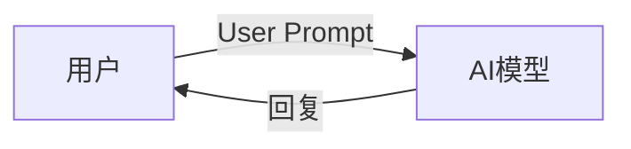
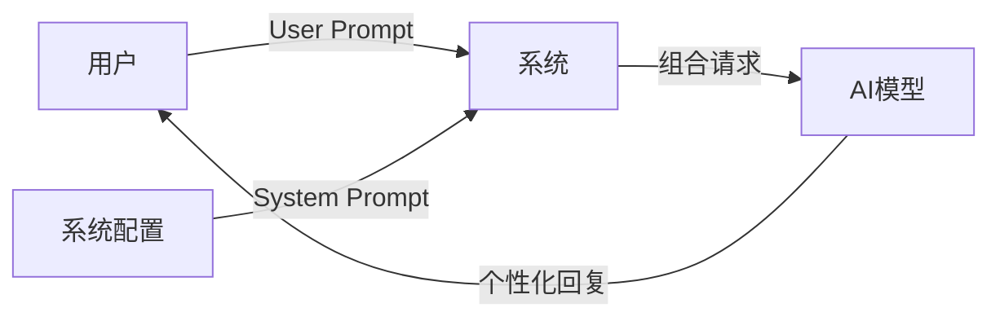
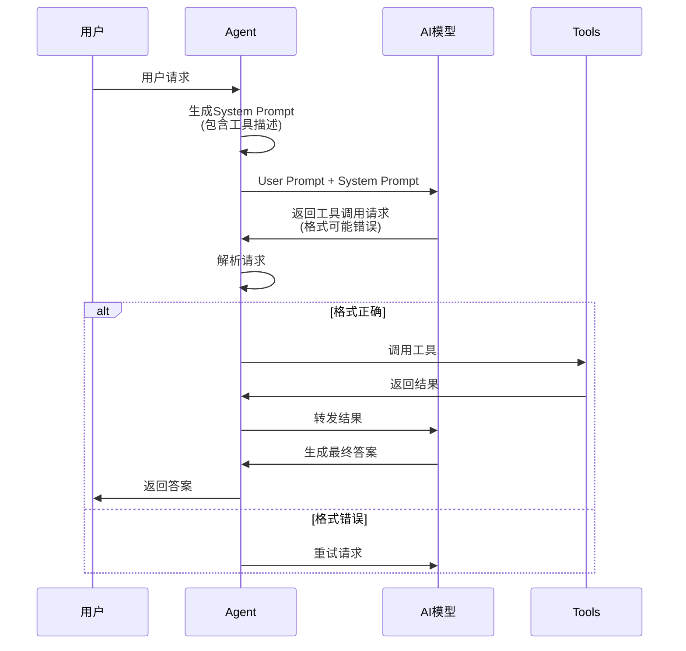
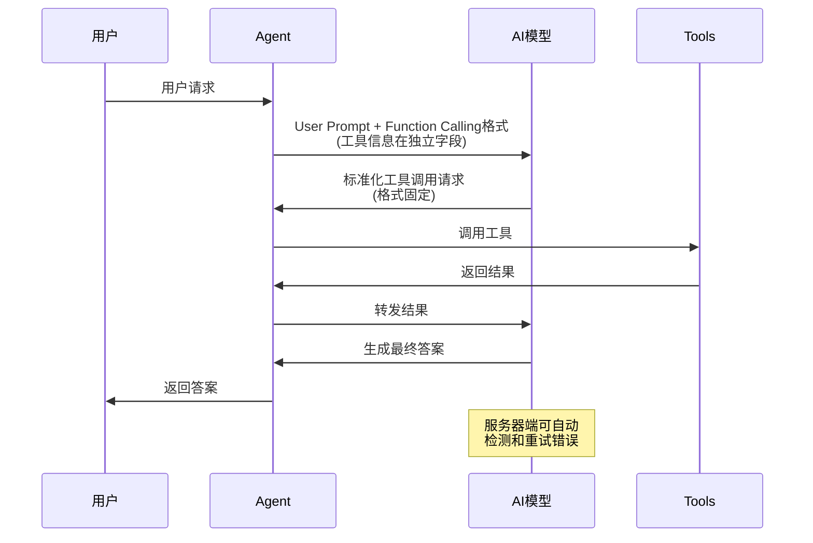
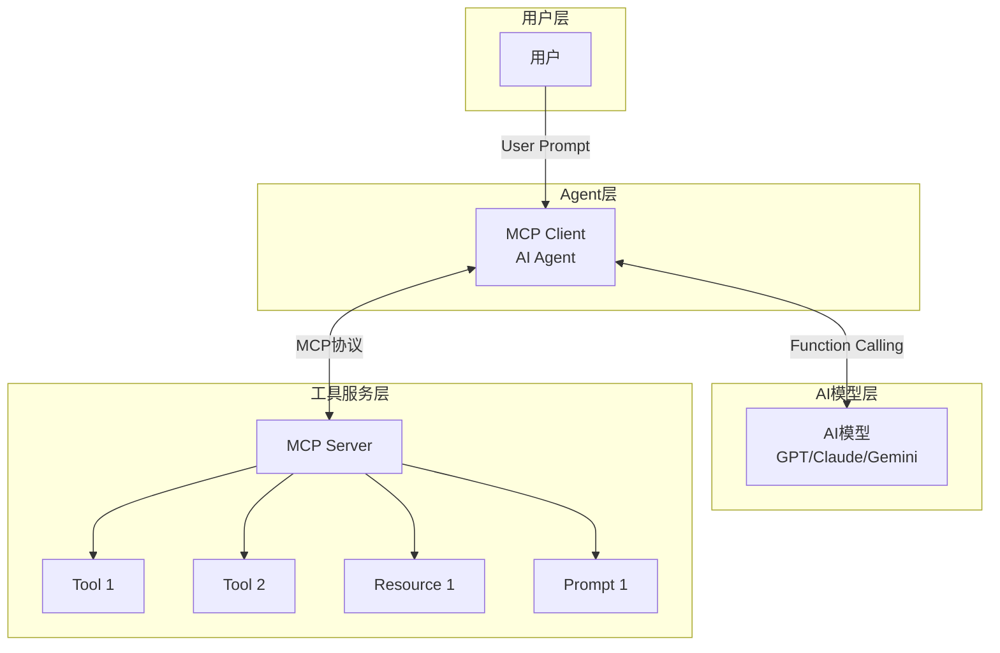
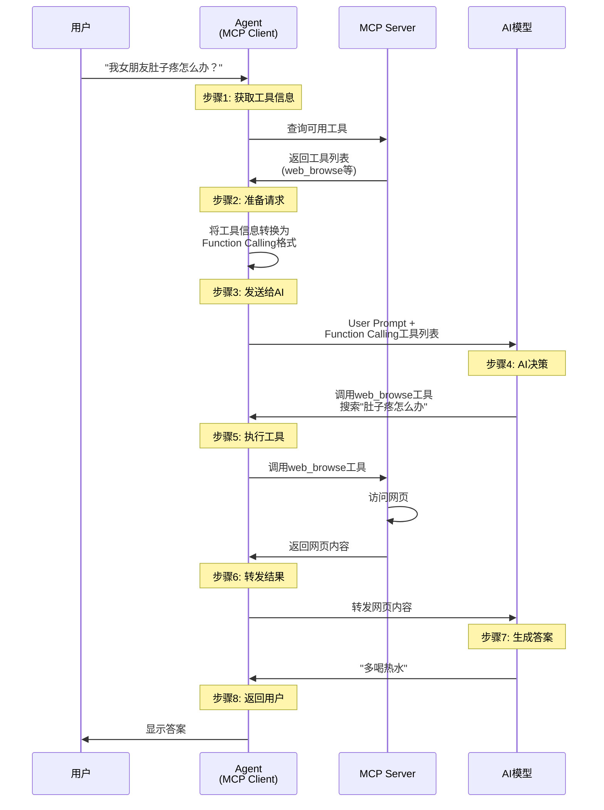
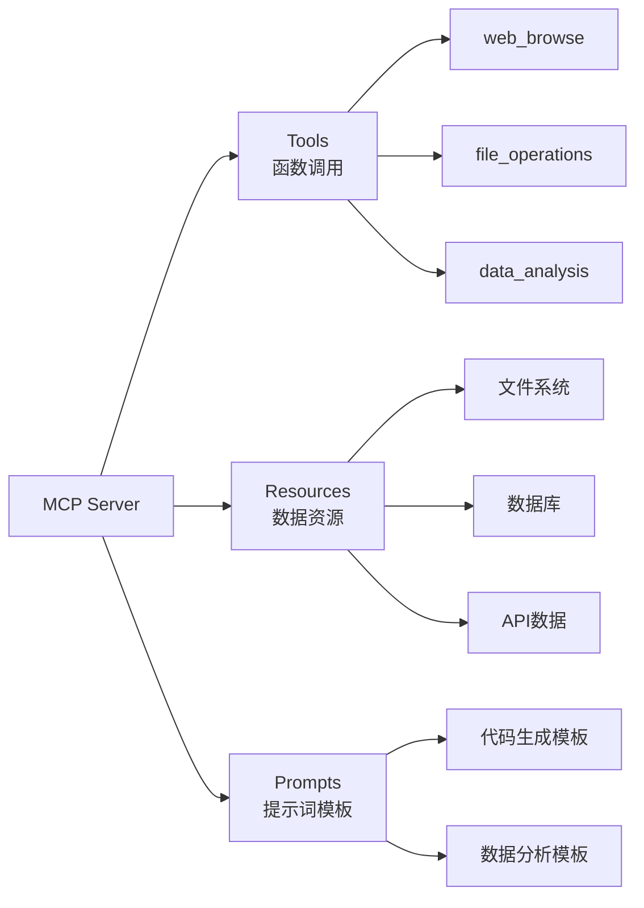

# AI Agent系统流程图详解

## 1. 基础对话流程



## 2. 带人设的对话流程



## 3. Agent工具调用流程（System Prompt方式）



## 4. Function Calling流程



## 5. MCP架构流程



## 6. 完整端到端流程



## 7. 技术演进对比

```mermaid
graph TD
    subgraph "阶段1: 基础聊天"
        A1[用户] -->|User Prompt| B1[AI模型]
        B1 -->|回复| A1
    end
    
    subgraph "阶段2: 人设设定"
        A2[用户] -->|User Prompt| C2[系统]
        D2[System Prompt] --> C2
        C2 --> B2[AI模型]
        B2 --> A2
    end
    
    subgraph "阶段3: 工具调用"
        A3[用户] --> E3[Agent]
        E3 -->|System Prompt+工具| B3[AI模型]
        B3 -->|工具调用| E3
        E3 -->|执行| F3[Tools]
        F3 --> E3
        E3 --> A3
    end
    
    subgraph "阶段4: 标准化"
        A4[用户] --> E4[Agent]
        E4 -->|Function Calling| B4[AI模型]
        B4 -->|标准化调用| E4
        E4 -->|执行| F4[Tools]
        F4 --> E4
        E4 --> A4
    end
    
    subgraph "阶段5: 服务化"
        A5[用户] --> E5[Agent]
        E5 <-->|MCP协议| G5[MCP Server]
        E5 <-->|Function Calling| B5[AI模型]
        G5 --> F5[Tools/Resources]
    end
```



## 8. 错误处理流程对比

```mermaid
graph TB
    subgraph "System Prompt方式"
        SP1[AI返回] --> SP2{格式正确?}
        SP2 -->|是| SP3[执行工具]
        SP2 -->|否| SP4[Agent重试]
        SP4 --> SP1
        SP3 --> SP5[返回结果]
    end
    
    subgraph "Function Calling方式"
        FC1[AI返回] --> FC2{格式正确?}
        FC2 -->|是| FC3[执行工具]
        FC2 -->|否| FC4[服务器自动重试]
        FC4 --> FC1
        FC3 --> FC5[返回结果]
        
        Note over FC4: 用户无感知<br/>节省token
    end
```

## 9. MCP Server服务类型



## 10. 多Agent共享MCP Server

```mermaid
graph TB
    subgraph "Agent层"
        A1[Agent 1]
        A2[Agent 2]
        A3[Agent 3]
    end
    
    subgraph "MCP Server"
        MS[统一工具服务]
        T[共享工具]
    end
    
    A1 -->|MCP协议| MS
    A2 -->|MCP协议| MS
    A3 -->|MCP协议| MS
    MS --> T
    
    Note over MS: 避免代码重复<br/>统一管理工具
```

---

## 流程图说明

以上流程图展示了：

1. **基础对话** → **人设设定** → **工具调用** → **标准化** → **服务化** 的演进过程
2. System Prompt 和 Function Calling 的区别
3. MCP 如何连接 Agent 和工具服务
4. 完整的端到端工作流程
5. 错误处理机制的对比
6. MCP Server 提供的三种服务类型
7. 多Agent共享工具的优势

这些流程图可以帮助理解整个AI Agent系统的运作机制。
